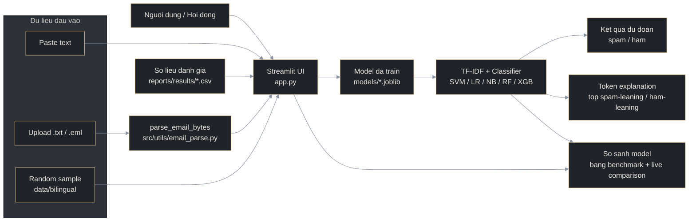
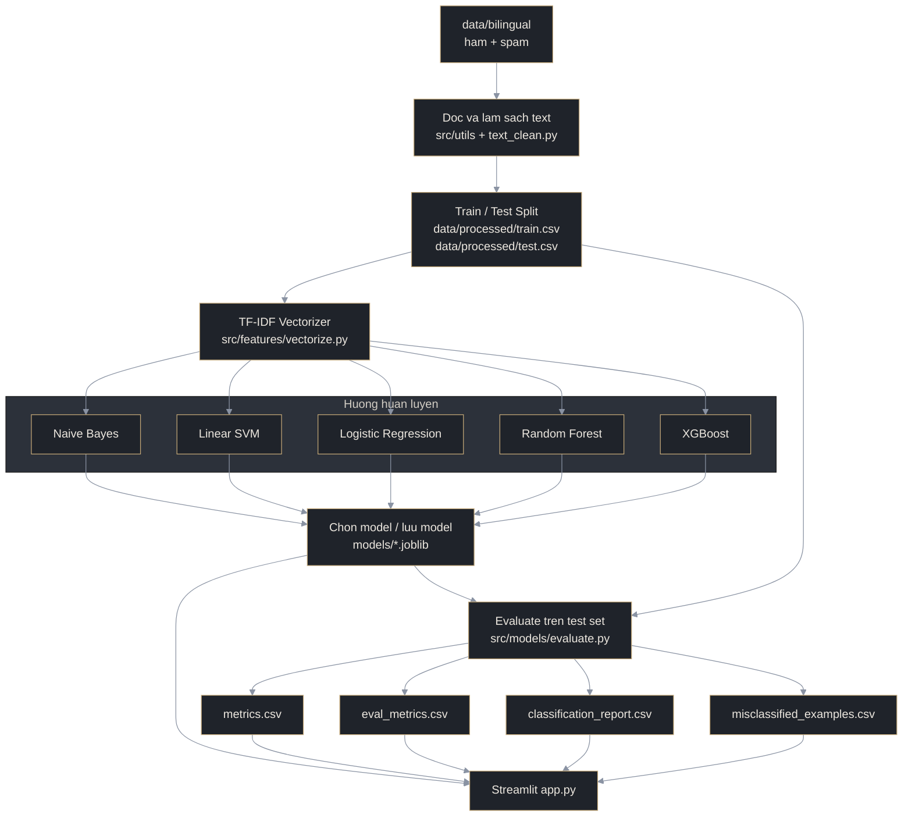

# So Do He Thong

File nay gom 2 so do Mermaid de dua vao bao cao, slide, hoac mo truc tiep trong IDE neu markdown viewer ho tro Mermaid.

## 1. So do tong quan he thong

## 2. So do pipeline train va evaluate

## 3. Cach trinh bay nhanh khi van dap

- So do 1 de giai thich app dang chay nhu the nao khi nguoi dung nhap email.
- So do 2 de giai thich quy trinh huan luyen, danh gia, va sinh ra cac file model/metric.
- Neu can noi ngan gon: `Input -> Parse/Clean -> TF-IDF -> Model -> Prediction -> Evaluation/Visualization`.
